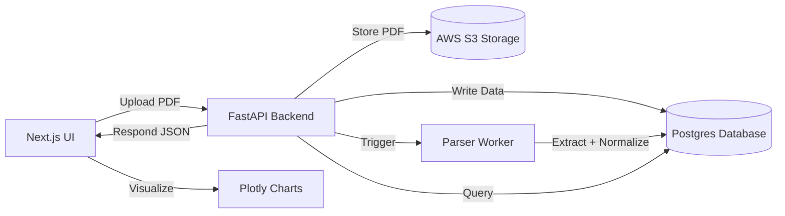

# Bloodwork Compiler

## 1. Project Description

Bloodwork Compiler is a **privacy-first health data platform** that parses, structures, and visualizes blood test results across multiple laboratory providers (e.g., LabCorp, Quest Diagnostics). The goal is to give individuals direct access to their own longitudinal health metrics in an interpretable, secure, and AI-assisted environment.

Unlike existing health portals that isolate reports by provider, Bloodwork Compiler normalizes values, tracks trends over time, and eventually provides AI-powered insights—all without exposing personal data to external APIs.

---

## 2. What It Solves

* **Fragmented health data:** Users receive blood reports from multiple labs, each with unique formats and terminologies. This project creates a unified structure for personal analytics.
* **Inaccessible trends:** Enables visualization of long-term health data (e.g., LDL, A1C) in an interactive dashboard.
* **Information latency:** Users can self-review results immediately rather than waiting for clinical follow-ups.
* **Data privacy:** Data remains encrypted, stored locally or in user-owned cloud infrastructure (S3), with no external sharing.

---

## 3. Prerequisites Before Cloning

### Local Setup Requirements

* **Operating System:** Windows 10+, macOS, or Linux
* **Python:** Version 3.11+
* **Node.js:** Version 20+ (for web UI)
* **Docker:** Latest (for Postgres and supporting services)
* **Tesseract OCR:** (optional) for PDF text extraction
* **VS Code or Cursor IDE:** with Python and TypeScript extensions

### Optional Services (Phase 4+)

* **AWS Account:** For S3, RDS (Postgres), and optional Lambda hosting
* **GitHub Actions:** For CI/CD integration

---

## 4. Developer Installation and Run Instructions

### Step 1: Clone and Set Up Environment

```bash
git clone https://github.com/<your-username>/bloodwork-compiler.git
cd bloodwork-compiler
python -m venv .venv
source .venv/bin/activate
pip install -U pip
pip install -r requirements.txt
```

### Step 2: Launch Local Postgres (Phase 2+)

```bash
docker compose -f ops/docker-compose.yml up -d
alembic upgrade head
```

### Step 3: Run Local Parsing (Phase 1)

```bash
python -m backend.app.parsers.run_local
pytest -q
```

### Step 4: Run FastAPI Server (Phase 3)

```bash
uvicorn backend.app.api.main:app --reload
```

### Step 5: Run Frontend UI (Phase 3)

```bash
cd frontend
npm install
npm run dev
```

Access at `http://localhost:3000` (UI) and `http://localhost:8000/docs` (API docs).

---

## 5. Architecture Overview

### End-to-End Stack Diagram



### Components

* **Frontend:** Next.js + TypeScript + Plotly
* **Backend:** FastAPI + SQLAlchemy (async) + Alembic
* **Storage:** Local or AWS S3 (presigned uploads)
* **Database:** Postgres 16 with RLS for per-user data isolation
* **Queue (optional):** Redis/RQ or AWS SQS for async parsing
* **CI/CD:** GitHub Actions + Alembic migrations + tests

---

## 6. Expected User Flow

### A. Python Proof-of-Concept (Phase 1)

1. User adds PDF under `data/sample_pdfs/`.
2. Script extracts text and tables using `pdfplumber`.
3. Parser normalizes test names and numeric values.
4. Results are saved as CSV and Parquet in `data/fixtures/`.
5. Developer reviews outputs manually or via Jupyter Notebook visualization.

### B. Web UI (Phase 3+)

1. User opens the upload page.
2. Uploads encrypted PDF (optionally client-side AES).
3. FastAPI receives and parses the file, stores metadata in Postgres.
4. Normalized test data is stored and indexed.
5. Chart page allows the user to select a test and visualize trends.
6. Optional: AI agent answers user questions over structured data.

---

## 7. Development Phases (End-to-End)

### **Phase 1: Python Parsing Playground (Local POC)**

**Goal:** Build a standalone script to extract and normalize blood test data.

**Technologies:** Python, pdfplumber, pandas, pydantic, pytest.

**Accomplishments:**

* Parse PDFs into structured rows (`LabRow` schema)
* Normalize test names and units
* Export to CSV/Parquet for inspection

**Milestones:**

* [ ] Create schema (`LabRow`)
* [ ] Implement parsing/normalization logic
* [ ] Generate CSV/Parquet outputs
* [ ] Validate extraction accuracy via tests

---

### **Phase 2: Database Integration (Persistence Layer)**

**Goal:** Store parsed data in Postgres for multi-user persistence.

**Technologies:** Postgres 16, SQLAlchemy 2.0 (async), Alembic, Docker, pytest.

**Accomplishments:**

* Introduced relational schema: Users, Documents, Labs
* Idempotent upserts from parser output
* Alembic-managed migrations

**AWS Services (optional):**

* RDS (managed Postgres)

**Milestones:**

* [ ] Configure local Postgres via Docker
* [ ] Add SQLAlchemy models + migrations
* [ ] Insert parsed data from Python POC
* [ ] Test inserts, queries, and constraints

---

### **Phase 3: Web API and Minimal UI**

**Goal:** Add FastAPI routes for uploads and queries, plus a simple Next.js interface.

**Technologies:** FastAPI, Next.js, TypeScript, Plotly, Axios, Pydantic.

**Accomplishments:**

* API endpoints: `/upload`, `/labs`
* OpenAPI documentation for developers
* Next.js upload + chart pages for end-users

**AWS Services (optional):**

* S3 for file uploads (via presigned URLs)

**Milestones:**

* [ ] Implement and test `/upload` route
* [ ] Implement and test `/labs` query route
* [ ] Create upload and chart pages in Next.js
* [ ] Integrate Plotly charts

---

### **Phase 4: Cloud, Security, and Automation**

**Goal:** Harden system for real-world deployment with privacy and automation.

**Technologies:** AWS S3, AWS RDS, GitHub Actions, Redis/RQ, OpenTelemetry, Sentry.

**Accomplishments:**

* Client-side AES encryption for uploads
* Presigned S3 URLs (serverless upload)
* Postgres Row-Level Security (RLS)
* CI/CD pipeline with linting, tests, migrations

**AWS Services:**

* S3 (storage)
* RDS (Postgres)
* Secrets Manager (env vars)
* Lambda or ECS (FastAPI hosting)

**Milestones:**

* [ ] Implement S3 presigned upload
* [ ] Add RLS and security policies
* [ ] Configure CI/CD via GitHub Actions
* [ ] Add OpenTelemetry traces + Sentry alerts

---

### **Phase 5 (Optional): AI Insight Layer**

**Goal:** Enable semantic querying and health explanations using local or hosted LLMs.

**Technologies:** pgvector, LangChain, Ollama, Promptfoo (evaluation).

**Accomplishments:**

* Vectorize test results and metadata
* Build retrieval-augmented Q&A agent
* Evaluate responses with prompt harness

**Milestones:**

* [ ] Integrate pgvector into Postgres
* [ ] Build embedding pipeline
* [ ] Add prompt evaluation suite (Promptfoo)
* [ ] Optional: Serve local LLM via Ollama

---

## 8. Integration Across Phases

Each phase builds directly upon the last:

* **P1 output** (CSV/Parquet) feeds **P2 ingestion** scripts.
* **P2 database** powers **P3 API endpoints**.
* **P3 API** drives **P3 UI charts**.
* **P4 cloud layer** secures everything built before it.
* **P5 AI layer** extends P4’s data model into intelligence.

This incremental design ensures that each milestone is production-aligned and testable in isolation.

---

## 9. License and Contribution

MIT License (planned)

To contribute:

* Fork the repository
* Follow guidelines in `CHANGE_REVIEW.md`
* Use AI assistance per `.cursorrules` and `AGENT-CONFIG.md`

---

## 10. Contact / Credits

Built by **Neel Patel**